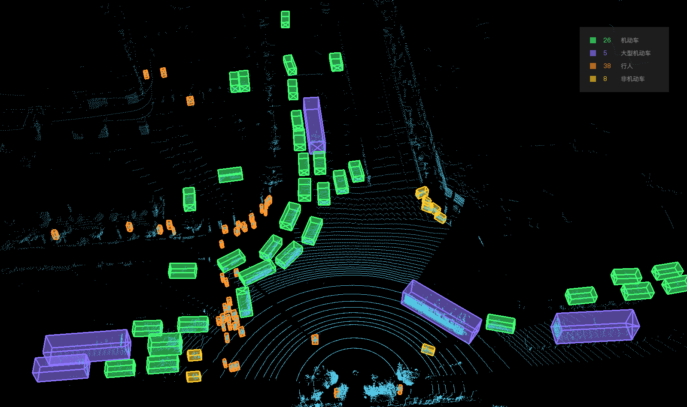
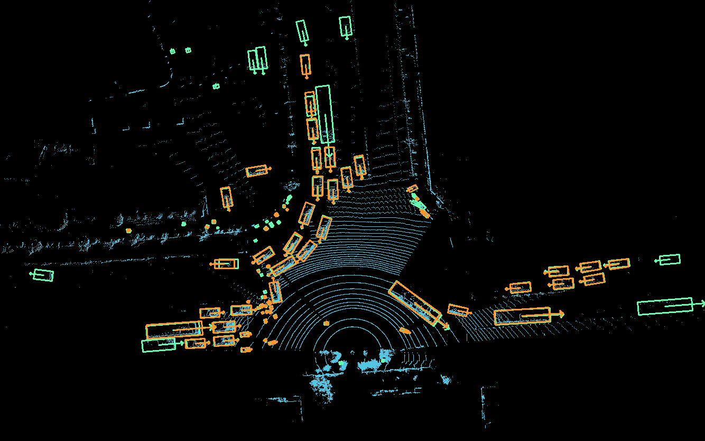
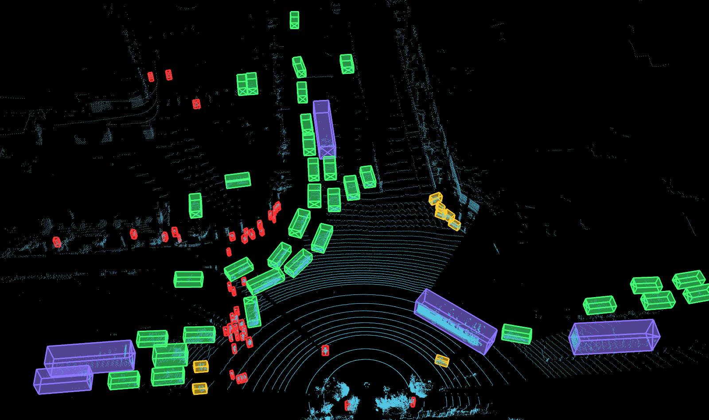

# 激光雷达检测可视化 (LOD Visualization)

## 介绍 (Introduction)



这是一个激光雷达检测可视化代码 (LOD Visualization Code)，它可以实现BEV下的绘制功能：
- *点云绘制* &nbsp;&nbsp; (Draw Point Cloud)
- *结果绘制* &nbsp;&nbsp; (Draw of Results)
- *标签绘制* &nbsp;&nbsp; (Draw Labels)
- *多边形绘制* &nbsp;&nbsp; (Draw Polygons)
- *体素绘制* &nbsp;&nbsp; (Draw Voxels)
- *图像贴图* &nbsp;&nbsp; (Draw Images)
- *结果与标签对比* &nbsp;&nbsp; (Draw Label and Results)

除了以上功能，这个代码还支持**单帧点云**和**多帧点云序列**的绘制，还有一个针对**v2x视角**（路口监控式）的配置功能。为了方便使用，我们尽可能简化输入参数。


## 安装步骤 (Install)

### 安装需求 (Requirements)

- Python 3.6+
- numpy, matplotlib, opencv, pypcd, tqdm, warnings, ...
- mayavi (可选，用于支持3D可视化，建议使用conda安装)


### 安装步骤 (Guidance)
以conda环境为例

```shell
$ conda create --name vis python=3.6 -y # 新建vis环境，这里建议选择python 3.6的环境
$ conda activate vis                    # 切换到vis环境
$ pip install VTK==8.1.2                # 新版本的vtk可能会与mayavi的功能冲突，建议安装8.1.2版本
$ pip install PyQt5                     # 安装pyqt
$ pip install numpy                     # 安装numpy
$ pip install mayavi                    # 安装mayavi
$ pip install opencv-python, matplotlib, lzf, tqdm  # 安装其他包
$ cd lib                                # 安装pypcd
$ unzip pypcd.zip 
$ cd pypcd-master
$ python setup.py install
```


## 使用方法 (Usage)

```shell
$ python cloud_visual.py --help
usage: cloud_visual.py  [-c | --cloud  path_to_cloud]
                        [-r | --result path_to_result]
                        [-l | --label  path_to_label]
                        [-p | --poly   path_to_poly]
                        [-v | --voxel  path_to_voxel]
                        [-i | --image  path_to_image]
                        [--viusal      save_path]

LiDAR Object Visualization

Optional argument:
  -h, --help                              show the help message
  -c, --cloud     path_to_cloud           input (default: None)
  -r, --result    path_to_result          input (default: None)
  -l, --label     path_to_label           input (default: None)
  -p, --poly      path_to_poly            input (default: None)
  -v, --voxel     path_to_voxel           input (default: None)
  -i, --image     path_to_image           input (default: None)

  --visual        path_to_visualizations  output (default: visual_image)
  --video_path    path_to_video           output (default: None)
  --v2x                                   set v2x view
  --draw_scale                            draw scales for BEV map
  --beg_index     N                       begin index for  sequence visualization
  --end_index     N                       end index for sequence visualization
  --colorize_by_intensity                 colorize BEV map by cloud intensity

For 3D Visualization
  --draw_3d                               3D Visualization
  --draw_ground                           Draw ground plane
  --demo                                  Use screenshot for demo
```
## 使用样例 (Examples)

我们会自动判别输入参数，进而单帧点云和多帧点云序列的绘制

如果你输入的是序列目录，那么**建议加入--visual参数**，指定输出路径

### 绘制点云

```shell
$ python cloud_visual.py \
  -c examples/v2x_examples/v2x_clouds/000100.bin
```

### 绘制点云和检测结果
```shell
$ python cloud_visual.py \
  -c examples/v2x_examples/v2x_clouds/000100.bin \
  -r examples/v2x_examples/v2x_results/000100.txt
```

### 绘制点云和标签
```shell
$ python cloud_visual.py \
  -c examples/v2x_examples/v2x_clouds/000100.bin \
  -l examples/v2x_examples/v2x_labels/000100.txt
```

如果提供的标签是跟踪格式，那么将绘制Track ID及Velocity箭头

### 绘制点云、检测结果和多边形分割结果
```shell
$ python cloud_visual.py \
  -c examples/car_examples/cloud/1599896706935279000.pcd \
  -r examples/car_examples/det/1599896706935279000.txt \
  -p examples/car_examples/poly/1599896706935279000.txt
```

### 绘制点云和体素分割结果
```shell
$ python cloud_visual.py \
  -c examples/voxel_examples/cloud/1597047594.462220000.pcd \
  -r examples/voxel_examples/result/1597047594.462220000.txt \
  -v examples/voxel_examples/voxel/1597047594.462220000.png
```

### 比对点云和标签
```shell
$ python cloud_visual.py \
  -c examples/v2x_examples/v2x_clouds/000100.bin \
  -r examples/v2x_examples/v2x_results/000100.txt \
  -l examples/v2x_examples/v2x_labels/000100.txt
```

为了方便观察，绿色的框是标签结果，黄色的框是检测结果，大概效果如下图所示。这个功能比较适合FP (False Positives)和FN (False Negatives)的绘制，可以直接看出当前帧的误检框(FP)和漏检框(FN)


### 3D可视化

#### V2X 3D可视化
3D的可视化功能，只需要在原有参数基础上，添加draw_3d选项即可。我们提供两种视角，分别是车端和V2X端，其中V2X是指路口的监控视角，加入--v2x就可以切换为V2X视角


```shell
$ python cloud_visual.py \
  -c examples/v2x_examples/v2x_clouds/000100.bin \
  -l examples/v2x_examples/v2x_labels/000100.txt \
  --draw_3d --v2x
```

#### 车端Voxel 3D可视化
新增了voxel的3D可视化功能，这里使用-v或者--voxel来指定voxel map的路径

```shell
$ python cloud_visual.py \
  -c examples/voxel_examples/cloud/1597047595.061229000.pcd \
  -r examples/voxel_examples/result/1597047595.061229000.txt \
  -v examples/voxel_examples/voxel/1597047595.061229000.png \
  --draw_3d
```

### 3D Demo
如果需要进一步制作demo，可以加入--use_screenshot参数。针对Car视角，将绘制自车模型。针对V2X视角，将统计每种类型的目标数量，并显示在右上角。

```shell
$ python cloud_visual.py \
  -c examples/v2x_examples/v2x_clouds/000100.bin \
  -l examples/v2x_examples/v2x_labels/000100.txt \
  --draw_3d --demo --v2x
```

### 保存视频

给定目录和视频路径，就可以将图像写入到视频之中

```shell
$ python cloud_visual.py \
  -c examples/v2x_clouds \
  -r examples/v2x_results \
  -l examples/v2x_labels \
  --video_path examples/v2x.mp4
```

如果是为了更好地生成视频，用于展示，建议用ffmpeg命令：
```shell
$ cd visual_directory
$ ffmpeg -framerate 30 -pattern_type glob -i '*.png' -c:v libx264 -r 30 -pix_fmt yuv420p
-s 1600x950 path_to_video
```

## 其他

### 安装pypcd

老版本代码使用pypcd来读取点云，如果需要安装pypcd，可以参考：

```shell
$ cd lib
$ unzip pypcd
$ cd pypcd-master
$ python setup.py install
```

